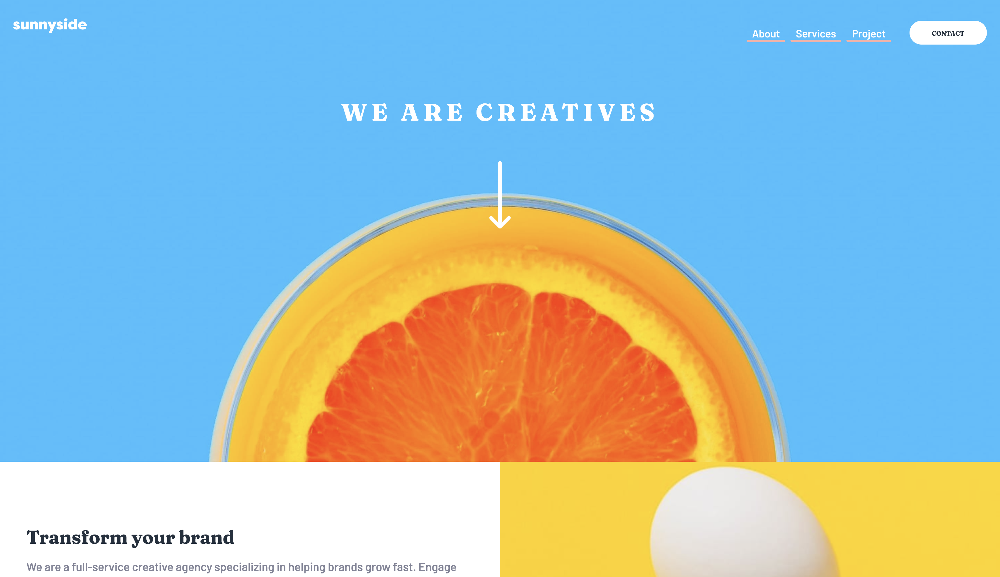

# Frontend Mentor - Sunnyside agency landing page solution

This is a solution to the [Sunnyside agency landing page challenge on Frontend Mentor](https://www.frontendmentor.io/challenges/sunnyside-agency-landing-page-7yVs3B6ef). Frontend Mentor challenges help you improve your coding skills by building realistic projects.

## Table of contents

- [Overview](#overview)
  - [The challenge](#the-challenge)
  - [Screenshot](#screenshot)
  - [Links](#links)
- [My process](#my-process)
  - [Built with](#built-with)
  - [What I learned](#what-i-learned)
  - [Continued development](#continued-development)
  - [Useful resources](#useful-resources)
- [Author](#author)

**Note: Delete this note and update the table of contents based on what sections you keep.**

## Overview

### The challenge

Users should be able to:

- View the optimal layout for the site depending on their device's screen size
- See hover states for all interactive elements on the page

### Screenshot

### Links

- Solution URL: [Check out my code](https://github.com/axseinga/sunnyside-agency-landing-page-main)
- Live Site URL: [and see live site here!](https://axseinga-sunnyside-agency-landing-page.netlify.app/)

## My process

### Built with

- Semantic HTML5 markup
- CSS & SASS
- Flexbox
- CSS Grid
- Mobile-first workflow
- vanilla JS
- love &#10084;

### What I learned

I coded this challenge as a break from another one that is way complicated however I found adjusting images in this one quite difficult. I decided to add some link effects and spent some time to find a solution for the underline effect for the button "Learn more". I had a chance to work on SASS architecture one more time and try to accommodate SASS code into separate files. I coded my media queries as breakpoints in mixins which is new to me.

### Continued development

I want to five deeper into JS animations.

### Useful resources

- [CSS Triangle](https://css-tricks.com/snippets/css/css-triangle/) - This helped me with creating ::after element for mobile menu.
- [20 Amazing Pure CSS Animated Buttons](https://1stwebdesigner.com/20-amazing-pure-css-animated-buttons/) - Very good article to get some inspirations.

## Author

- Website - [Axseinga](https://www.your-site.com)
- Frontend Mentor - [@Axseinga](https://www.frontendmentor.io/profile/yourusername)
- LinkedIn - [Agnieszka Urbanowicz](https://www.linkedin.com/in/agnieszka-urbanowicz-051147151/)
